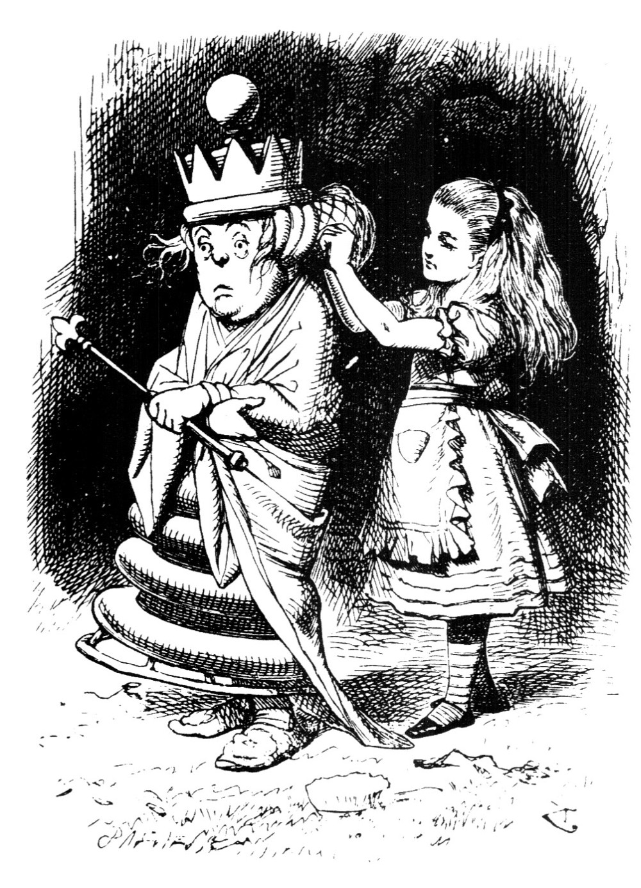
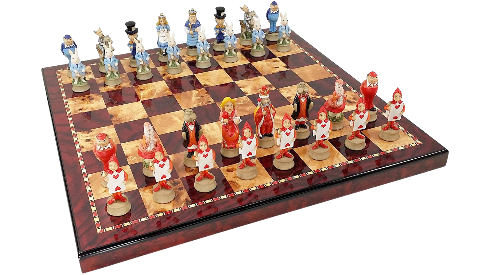

# Alice Através do Espelho | ChessGame



## 📖 Sobre o Projeto

O ChessGame é uma aplicação de xadrez desenvolvida em Java, inspirada nos clássicos livros de Lewis Carroll, "**Alice no País das Maravilhas**" e "**Alice Através do Espelho**". O jogo traz a essência dessas obras, onde Alice precisa navegar por um mundo surreal que se assemelha a um gigantesco tabuleiro de xadrez.

O projeto foi criado para ser uma experiência de jogo clássica, mas com um toque visual único, substituindo as peças tradicionais por personagens icônicos dos livros. A interface gráfica é construída usando a biblioteca Swing, garantindo uma experiência interativa e amigável.



## Funcionalidades

-   **Tabuleiro Interativo:** Jogue xadrez clicando nas peças e nas casas.
-   **Temática Única:** Peças personalizadas com personagens de "Alice Através do Espelho".
-   **Histórico de Lances:** Acompanhe o progresso da partida em notação de xadrez.
-   **Partida contra a IA:** Enfrente um adversário controlado pelo computador com diferentes níveis de dificuldade.
-   **Indicação de Movimentos:** Realce de casas para indicar peças selecionadas, movimentos legais e o último lance.
-   **Promoção de Peão:** Caixa de diálogo para escolher a peça de promoção.

## Tecnologias

-   **Linguagem de Programação:** Java
-   **Biblioteca de UI:** Java Swing

## Como Rodar o Jogo

Siga estas instruções para compilar e executar o projeto.

### Pré-requisitos

-   JDK (Java Development Kit) 17 ou superior instalado.
-   Uma IDE como VS Code, IntelliJ IDEA ou Eclipse.

### Instruções

1.  **Clone o repositório:**
    ```bash
    git clone [https://github.com/seu-usuario/seu-repositorio.git](https://github.com/seu-usuario/seu-repositorio.git)
    cd seu-repositorio
    ```

2.  **Abra o projeto na sua IDE:**
    Importe a pasta do projeto para a sua IDE.

3.  **Compile e Execute:**
    -   Certifique-se de que todas as dependências estejam configuradas corretamente.
    -   Encontre o arquivo `ChessGUI.java` (localizado em `src/view/ChessGUI.java`).
    -   Execute a classe `ChessGUI` para iniciar o jogo.

## Estrutura do Projeto

A estrutura do projeto está organizada da seguinte forma:

-   `src/controller/`: Lógica do jogo (como a IA e o controle da partida).
-   `src/model/`: Classes que representam o tabuleiro, as peças e as regras do jogo.
-   `src/view/`: Componentes da interface gráfica, incluindo a classe `ChessGUI`.